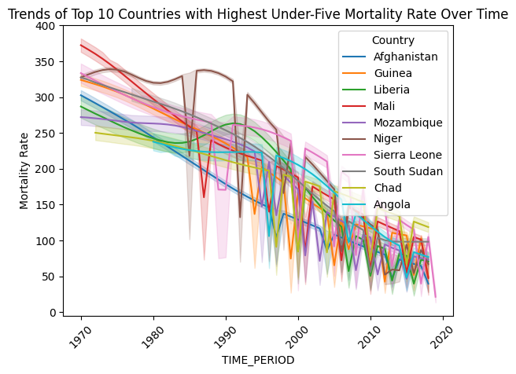

# 🧒 Global Child Mortality Analysis & Risk Factors

This project analyzes child mortality (age 1–4) using multiple global datasets, combining demographic, regional, and malnutrition data to uncover key mortality trends and drivers. It includes statistical QA, visualizations, clustering, and a basic predictive model.

---

## 📌 Objectives

- Examine trends in child mortality by gender and region from 1950–2020.
- Identify countries with persistently high mortality.
- Explore correlations between mortality, population, and malnutrition.
- Apply clustering and regression to interpret and predict outcomes.

---

## 📊 Datasets Used

| Dataset | Description | Rows | Key Fields |
|--------|-------------|------|------------|
| **Child Mortality** | Mortality rate, population, gender, country/year | 30,940 | `Mortality Rate`, `Total Population`, `Gender` |
| **Malnutrition** | Nutrition status by country/year | 30,901 | `OBS_VALUE`, `Country`, `Year` |
| **Region Data** | Country-level metadata | 5,302 | `Geographic Area`, `OBS_VALUE` |

---

## 🧼 Data Cleaning & QA

- All datasets cleaned: 0% missing after preprocessing.
- Joined across `Country` and `Year`.
- Verified data types and value ranges.
- Outlier checks revealed 3,050 high-mortality observations.
- Correlation analysis shows:
  - **Mortality ↔ Malnutrition**: **+0.88** (strong)
  - **Mortality ↔ Population**: weakly negative

---

## 📈 Visual Explorations

### 📉 Mortality Trends (1950–2020)
- Steady global decline from >2 to <0.3 deaths per 1000.
- Gender gap slightly favors females in later years.

### 📊 Mortality by Gender

### 🌍 Top 10 Countries by Mortality

### 📊 Country-Specific Trends

### 📈 Correlation Heatmaps

### 🔍 Clustering by Risk

---

## 📈 Predictive Modeling

### 🔹 Linear Regression
- Inputs: Year
- Output: Smoothed Mortality Rate
- **R² score**: 0.138 (basic model)
- Shows decreasing trend but suggests potential for more advanced models.

---

## 🧠 Key Insights

- High mortality persists in Sub-Saharan African countries.
- Strong link found between malnutrition and child deaths.
- Population size has weak correlation with mortality.
- Gender-based mortality differences have shrunk over time.

---

## 🚀 Future Work

- Integrate multivariate regression (malnutrition, spending, conflict).
- Use LSTM or ARIMA for time-series forecasting.
- Build a Streamlit app for interactive exploration.

---

## 👤 Author

**Ussayed Shakeel Abbasi**  
📫 usalcgg18@gmail.com  
🔗 [LinkedIn](https://linkedin.com/in/abbasi303) | [GitHub](https://github.com/abbasi303)

---

📁 *This project demonstrates cross-domain data integration, trend analysis, and simple modeling — with strong real-world implications for global development.*
